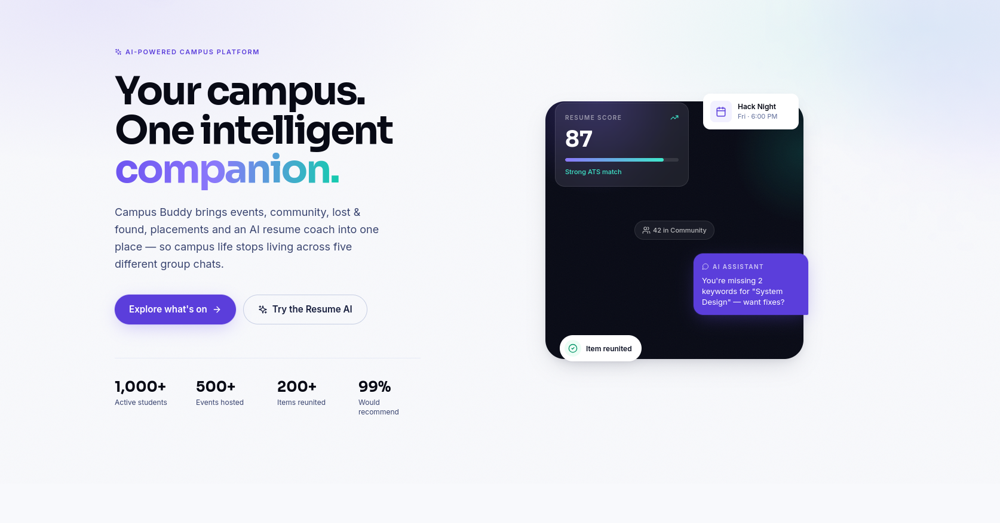
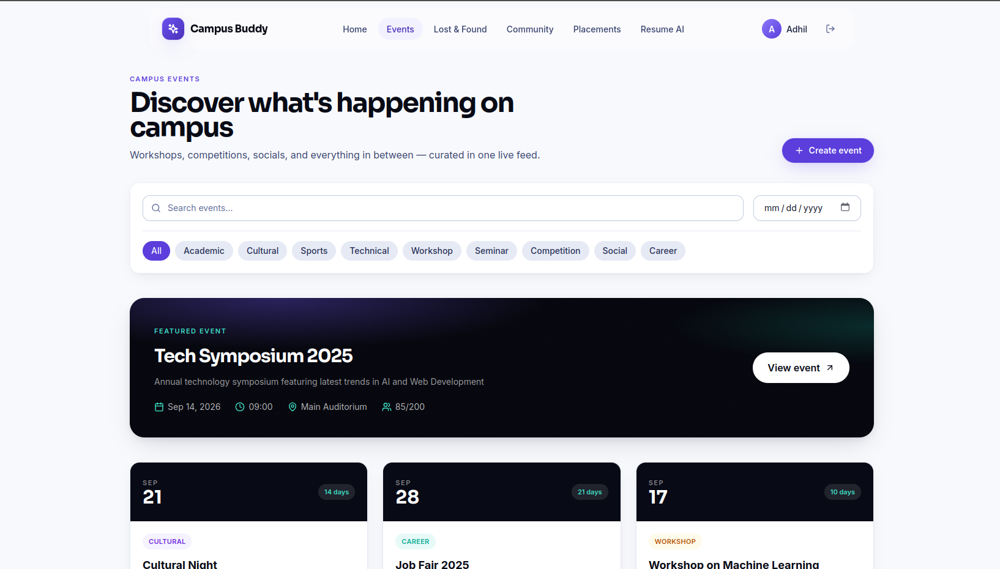
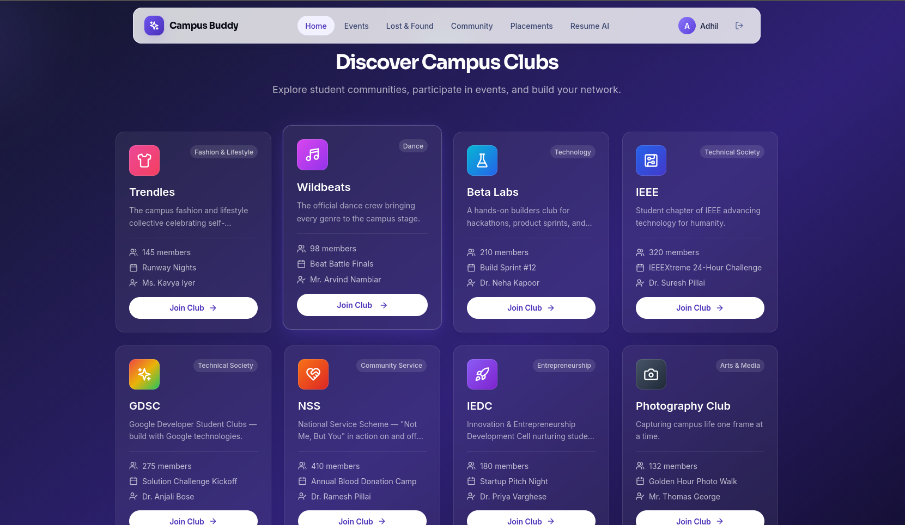
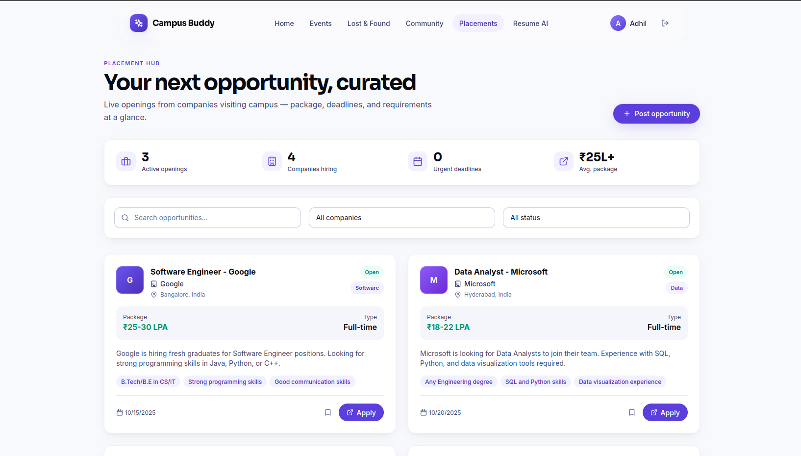
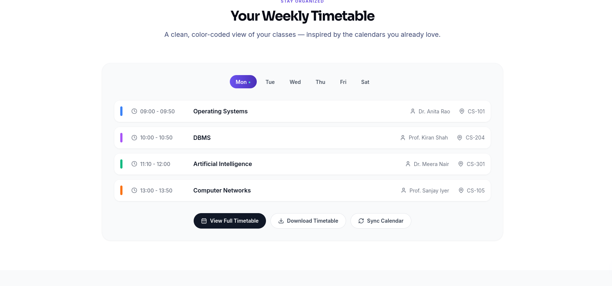
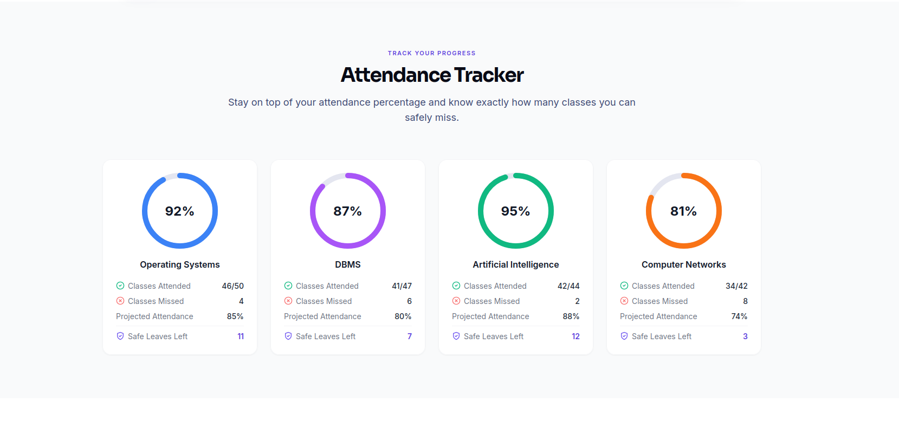
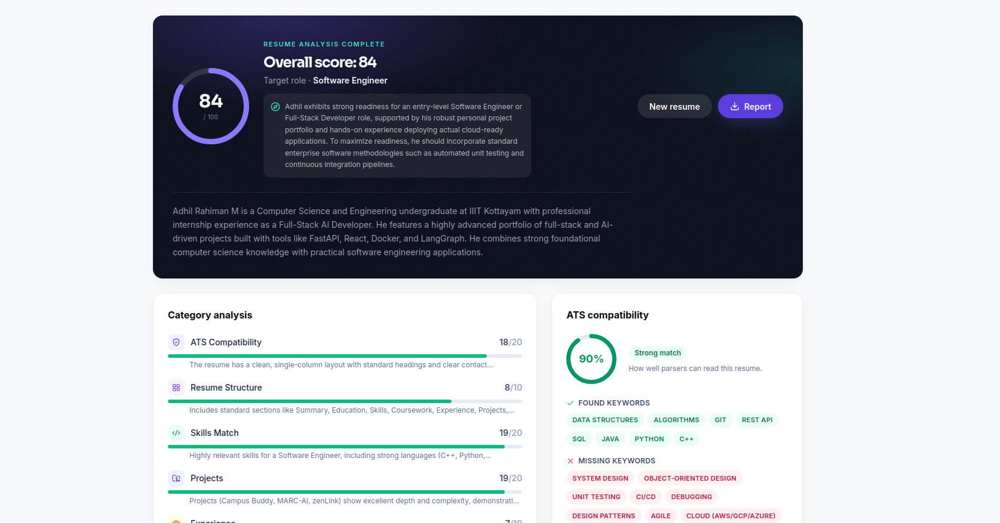
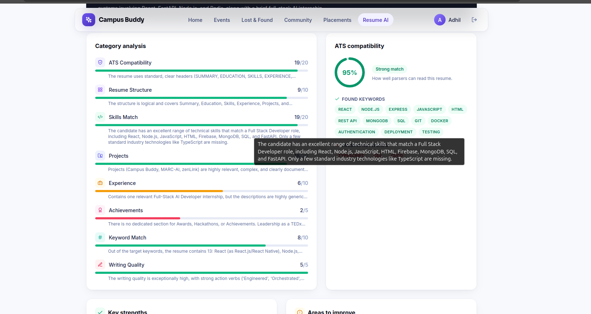
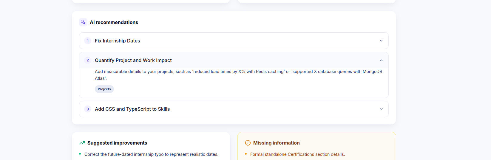

# 🎓 Campus Buddy

<div align="center">



<br>
<br>

# Campus Buddy

### AI-Powered Smart Campus Management Platform

**Your campus. One intelligent companion.**

A modern all-in-one platform that brings campus events, clubs, academics,
placements, lost & found, community, and AI-powered career tools together
in one connected experience.

<br>

[](YOUR_LIVE_DEMO_URL)
[](YOUR_GITHUB_URL)

<br>
<br>


</div>

---

## 🌟 Why Campus Buddy?

University life is often spread across multiple disconnected platforms.

One place for events.

Another for attendance.

Another for clubs.

Another for placements.

And somewhere else, students search for lost items or career guidance.

**Campus Buddy brings these experiences together.**

It is designed as a unified digital campus ecosystem where students,
clubs, faculty, and administrators can interact through a single modern
platform.

### One platform. Multiple campus experiences.

| 📅 Events | 👥 Clubs | 🗓 Timetable |
|:---:|:---:|:---:|
| Discover and register for campus events | Discover and join student organizations | Manage weekly academic schedules |

| 📊 Attendance | 🔎 Lost & Found | 💼 Placements |
|:---:|:---:|:---:|
| Track attendance and projected percentage | Report, search, and recover items | Explore internships and opportunities |

| 🤖 AI Resume Coach | 📢 Community | 🔔 Notifications |
|:---:|:---:|:---:|
| Analyze resumes and improve job readiness | Campus discussions and announcements | Stay updated with important activity |

---

# ✨ Product Experience

Campus Buddy is built around a simple idea:

> **Make everyday campus life easier from one place.**

---

## 🏠 A Modern Campus Homepage

The homepage acts as the central entry point into the campus ecosystem.

It provides quick access to the most important student experiences while
maintaining a clean, modern interface.

<p align="center">
  
</p>

### Design highlights

- ✨ Modern SaaS-inspired interface
- 🎨 Clean visual hierarchy
- 🧊 Glassmorphism-inspired UI elements
- 🎞 Smooth animations
- 📱 Responsive design
- 🧭 Clear navigation between campus services

---

# 🚀 Core Campus Features

## 📅 Smart Event Management

Discover what is happening around campus and register for events
without switching between different platforms.

<p align="center">
  
</p>

### Features

- Event discovery
- Online registration
- Event categories
- Seat availability
- Event countdowns
- Event posters
- Organizer management

---

## 👥 Club Management

Campus Buddy provides a dedicated space for student organizations.

Students can discover clubs, explore their activities, and participate
in campus communities.

<p align="center">
  
</p>

### Club capabilities

- Club profiles
- Faculty coordinators
- Member counts
- Club galleries
- Upcoming events
- Recruitment
- Join club functionality
- Club achievements

### Example campus organizations

`Trendles` · `Wildbeats` · `Beta Labs` · `IEEE` · `GDSC` · `NSS` · `IEDC`

---

## 🔎 Lost & Found

A dedicated campus marketplace for recovering lost belongings.

<p align="center">
  
</p>

### Features

- Report lost items
- Upload item images
- Search found items
- Categorize items
- Claim requests
- AI-assisted matching

The goal is simple:

**Make it easier for a lost item to find its owner.**

---

## 🎓 Placement Hub

A centralized career and placement space for students.

<p align="center">
  
</p>

### Features

- Internship updates
- Company drives
- Placement resources
- Recruitment information
- Career guidance
- Opportunity discovery

---

# 📚 Academic Tools

Campus Buddy also brings everyday academic utilities into the same
student experience.

---

## 🗓 Timetable Management

Students can quickly access their academic schedule and classroom
information.

<p align="center">
  
</p>

### Features

- Weekly timetable
- Today's classes
- Faculty information
- Classroom details
- Timetable download
- Calendar integration

---

## 📊 Attendance Tracker

Track attendance without manually calculating percentages.

<p align="center">
  
</p>

### Features

- Subject-wise attendance
- Attendance percentage
- Safe leave calculation
- Projected attendance
- Visual progress indicators

---

# 🤖 AI-Powered Career Intelligence

One of the core differentiators of Campus Buddy is its AI-powered
career tooling.

Instead of simply displaying information, the platform can analyze
student data and provide actionable feedback.

---

## 📄 AI Resume Analyzer

Students can upload their resumes and receive structured AI-powered
feedback.

<p align="center">
  
</p>

The analyzer focuses on areas such as:

- ATS compatibility
- Resume structure
- Skills
- Projects
- Experience
- Keywords
- Job-readiness

---

## 📊 Detailed Resume Analysis

The analysis view turns the resume into a structured evaluation.

<p align="center">
  
</p>

### Example evaluation areas

| Category | Purpose |
|---|---|
| ATS Compatibility | Evaluate how easily applicant tracking systems can parse the resume |
| Resume Structure | Check organization and standard resume sections |
| Skills Match | Identify relevant technical skills |
| Projects | Evaluate practical project experience |
| Experience | Assess professional experience |
| Keywords | Identify relevant or missing terminology |

The goal is not just to give a score.

**It is to help students understand what they can improve.**

---

## 🧠 AI-Powered Observations

AI-generated observations provide additional context around the student's
career readiness and potential improvements.

<p align="center">
  
</p>

This turns resume analysis from a simple checker into a more useful
career feedback experience.

---

# 🌐 Campus Ecosystem

Campus Buddy is designed to connect different parts of student life
rather than treating them as isolated modules.

### The ecosystem

```text
                         ┌───────────────────┐
                         │   CAMPUS BUDDY    │
                         │   AI PLATFORM     │
                         └─────────┬─────────┘
                                   │
          ┌────────────────────────┼────────────────────────┐
          │                        │                        │
          ▼                        ▼                        ▼
     📚 Academics             🎯 Careers              👥 Community
          │                        │                        │
     ┌────┴────┐              ┌────┴────┐           ┌─────┴─────┐
     │         │              │         │           │           │
 Timetable Attendance       Resume   Placements   Clubs       Events
     │         │              │         │           │           │
     └─────────┴──────────────┴─────────┴───────────┴───────────┘
                                   │
                                   ▼
                              🔎 Lost & Found
